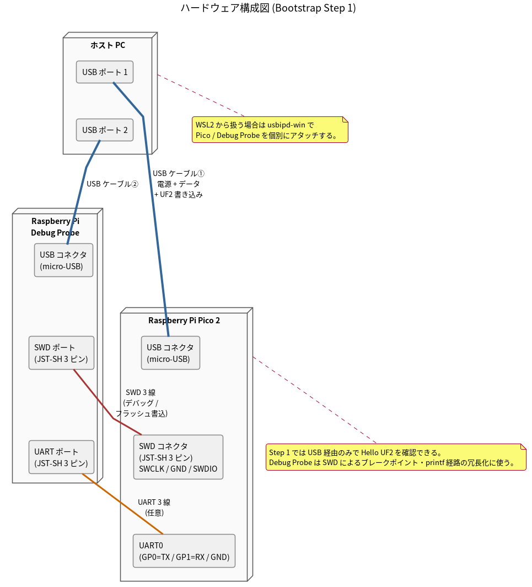
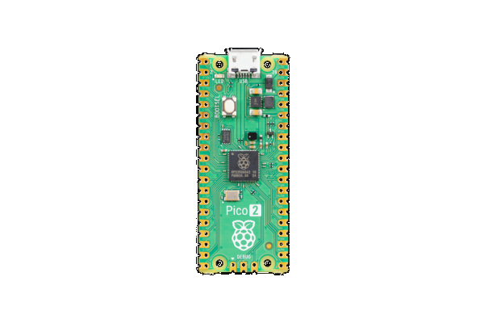
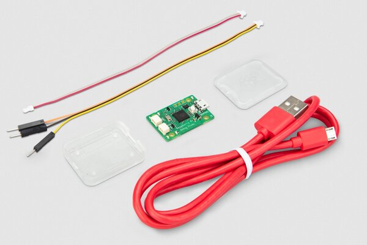
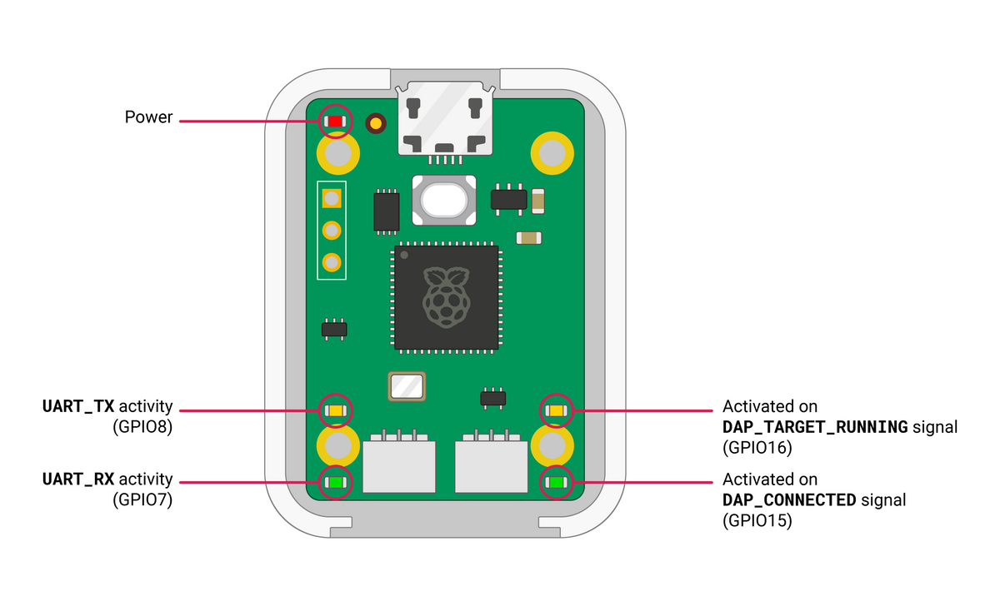
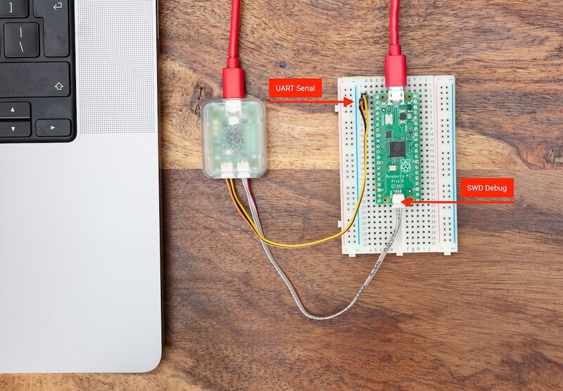
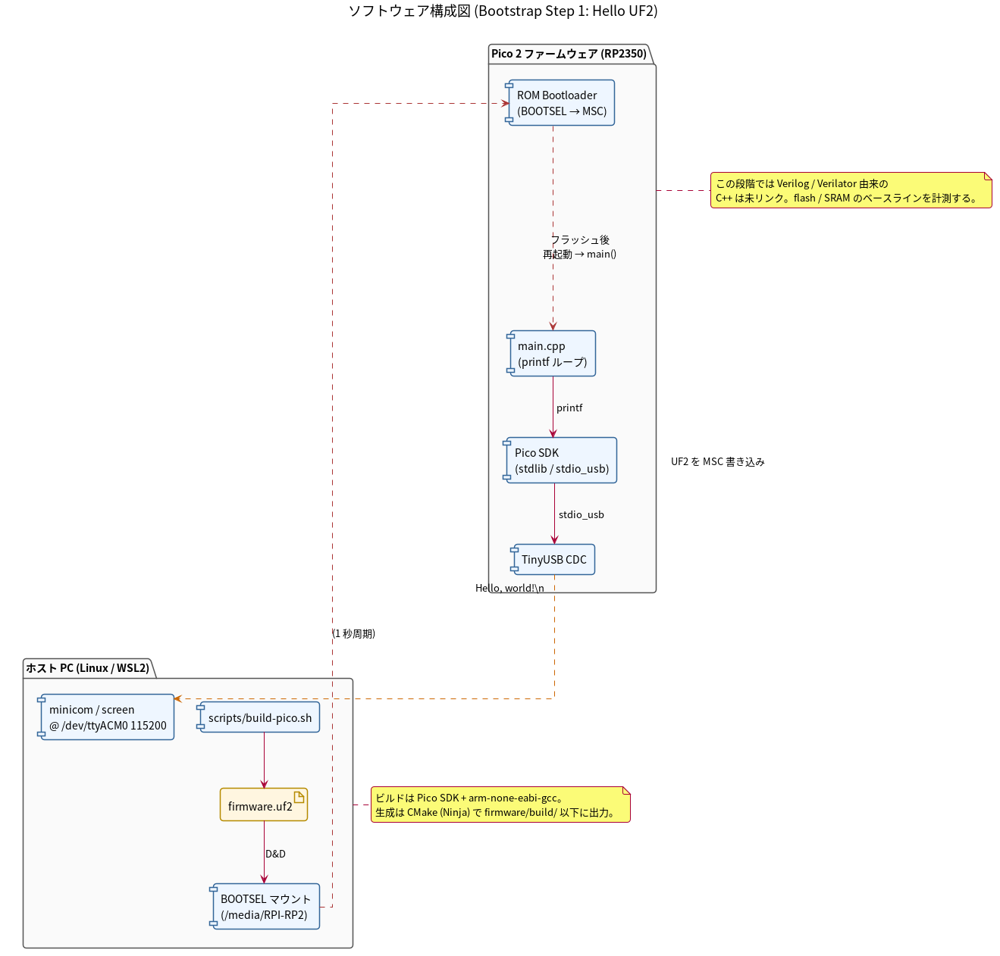

# 01-構成図

Bootstrap Step 1（Hello UF2）時点での構成。**ハードウェア**と**ソフトウェア**を分離して図示する。

## ハードウェア構成図

物理的に存在するもの・配線のみ。ソフトウェアの責務は含めない。

ソース: [`01-hardware.puml`](01-hardware.puml)

### 構成要素

| 要素 | 仕様 |
| --- | --- |
| ホスト PC | Linux / WSL2。USB ポートを 2 口使用 |
| USB ケーブル ① | PC ↔ Pico 2。USB-A ↔ micro-USB。電源 + データ + UF2 書き込み |
| USB ケーブル ② | PC ↔ Debug Probe。USB-A ↔ micro-USB |
| Raspberry Pi Debug Probe | CMSIS-DAP 互換のデバッガ。ホスト側は **micro-USB**、ターゲット側は SWD / UART を JST-SH 3 ピンで提供 |
| SWD 3 線 | Probe SWD ポート ↔ Pico 2 SWD コネクタ (JST-SH 3 ピン: SWCLK / GND / SWDIO)。デバッグ・フラッシュ書込 |
| UART 3 線 | Probe UART ポート ↔ Pico 2 UART0 (GP0=TX / GP1=RX / GND)。シリアル中継、任意 |
| Pico 2 / USB コネクタ | **micro-USB**（純正は USB-C ではない） |

### 現物写真

| Raspberry Pi Pico 2 | Raspberry Pi Debug Probe |
| --- | --- |
|  |  |
| `2e8a:000a` (RP2350) / micro-USB | `2e8a:000c` (CMSIS-DAP v2) / micro-USB |

写真出典: [Raspberry Pi 公式ドキュメントリポジトリ][rpf-docs] より
[`pico-2.png`][src-pico2] および [`debug-probe.jpg`][src-probe]
（**CC-BY-SA 4.0** / リサイズのみ実施）

[rpf-docs]: https://github.com/raspberrypi/documentation
[src-pico2]: https://github.com/raspberrypi/documentation/blob/master/documentation/asciidoc/microcontrollers/pico-series/images/pico-2.png
[src-probe]: https://github.com/raspberrypi/documentation/blob/master/documentation/asciidoc/microcontrollers/debug-probe/images/debug-probe.jpg

### Pico 2 ピン配置 (USB / SWD / UART0 の物理位置)

本プロジェクトで使う 3 つのコネクタ / ピンが図のどこにあるか:

| コネクタ / ピン | 図上の位置 | 用途 |
| --- | --- | --- |
| **micro-USB** | 基板上端中央（"USB" と書かれている側） | 給電 + USB-CDC ホスト直結（純正は USB-C ではない） |
| **DEBUG (SWD) 3 ピン** | 基板下端中央。"DEBUG" 表記の JST-SH 3 ピン (SWCLK / GND / SWDIO の順) | Debug Probe 経由のフラッシュ・ブレークポイント |
| **UART0** | 左列の **Pin 1 = GP0/UART0 TX**、**Pin 2 = GP1/UART0 RX**、Pin 3 = GND | Probe の UART ブリッジ → ホスト `/dev/ttyACM0` |

図出典: [Raspberry Pi 公式ドキュメント — Pico 2 pinout][src-pico2-pinout]
（CC-BY-SA 4.0 / 無改変で再配布）

[src-pico2-pinout]: https://github.com/raspberrypi/documentation/blob/master/documentation/asciidoc/microcontrollers/pico-series/images/pico-2-r4-pinout.svg

### Debug Probe コネクタ配置 (USB / SWD / UART)

本プロジェクトで使う 3 コネクタの物理位置（USB を上にして見た時）:

| コネクタ | 図上の位置 | 識別の手がかり | 用途 |
| --- | --- | --- | --- |
| **micro-USB** | 基板上端中央 | "Power" LED が左横に隣接 | ホスト PC へ接続 (給電 + CMSIS-DAP + UART bridge を 1 本で多重化) |
| **UART ポート** (3-pin JST-SH) | 基板下端の **左** | 直上に **UART_TX/RX activity LED**（黄/緑）。ケース表面の `U` 刻印 | Pico 2 の UART0 (GP0/GP1) と接続。Probe 内部で USB-CDC にブリッジされて `/dev/ttyACM0` |
| **SWD ポート** (3-pin JST-SH) | 基板下端の **右** | 直上に **DAP_TARGET_RUNNING / DAP_CONNECTED LED**（黄/緑）。ケース表面の `D` 刻印 | Pico 2 の DEBUG コネクタと接続。openocd が SWCLK / SWDIO を駆動してフラッシュ・ブレークポイント |

LED 自体は実行時の状態表示用（Power / UART activity / DAP target running / DAP connected）で、
**ポートの種別を識別する第一の手がかりはケース上の `U` / `D` 刻印**。LED 配置はそれを補強する形になっている。

図出典: [Raspberry Pi 公式ドキュメント — Debug Probe LEDs][src-probe-leds]
（CC-BY-SA 4.0 / 横 1200px に縮小のみ）

[src-probe-leds]: https://github.com/raspberrypi/documentation/blob/master/documentation/asciidoc/microcontrollers/debug-probe/images/debug-leds.png

### 実体接続例 (USB ケーブル × 2 + SWD/UART 配線)

ハードウェア構成図と同じ接続を実機で示すと上図のようになる。読み取れる対応関係:

| 図上の要素 | 構成図のどれか |
| --- | --- |
| 左上の MacBook の USB-A 端子 (赤ケーブル) | ホスト PC ↔ Debug Probe の **USB ケーブル ②** |
| 右上から伸びる赤ケーブル | ホスト PC ↔ Pico の **USB ケーブル ①** |
| 中央の透明ケース＋ Raspberry Pi ロゴの小基板 | **Raspberry Pi Debug Probe** (上が micro-USB、下面の左右に UART / SWD ポート) |
| ブレッドボード上の細長い基板 | **Pico**（写真は無印 Pico だが Pico 2 はピン配置・micro-USB 位置とも完全互換） |
| "UART Serial" と書かれた橙ケーブル群 | **UART 3 線** (Probe → Pico GP0/GP1/GND) |
| "SWD Debug" と書かれた灰色ケーブル | **SWD 3 線** (Probe → Pico DEBUG コネクタ SWCLK/GND/SWDIO) |

写真は無印 Pico を使っているが、本プロジェクトの **Pico 2 でも配線・ケーブル種別は完全に同一**
（DEBUG コネクタの形状・位置、GP0/GP1 の物理位置、micro-USB の位置はすべて維持されている）。
USB-C 採用品はサードパーティ版 Pico 2 のみで、純正は本写真と同じく micro-USB。

図出典: [Raspberry Pi 公式ドキュメント — Debug Probe labelled-wiring][src-probe-wiring]
（CC-BY-SA 4.0 / 横 800px に縮小のみ）

[src-probe-wiring]: https://github.com/raspberrypi/documentation/blob/master/documentation/asciidoc/microcontrollers/debug-probe/images/labelled-wiring.jpg

### 留意点

- Step 1 の Hello UF2 は USB ケーブル ① 単独でも動作確認できる。Debug Probe は **SWD によるブレークポイントと printf 経路の冗長化** が目的（後段でフラッシュサイズが増えた際の段階的な書き込み高速化にも効く）
- WSL2 から扱う場合は Windows 側で `usbipd attach` により Pico / Debug Probe を**個別に**アタッチする
- 純正 Pico 2 と純正 Debug Probe はいずれもホスト側 **micro-USB**。USB-A ↔ micro-USB のケーブルを 2 本用意する（USB-C を採用しているのはサードパーティ版のみ）

---

## ソフトウェア構成図

ホスト側ビルドパイプラインと Pico 2 上のランタイムスタック、およびデータフロー。

ソース: [`02-software.puml`](02-software.puml)

### ホスト PC 側

| コンポーネント | 役割 |
| --- | --- |
| `scripts/build-pico.sh` | Pico SDK + arm-none-eabi-gcc、CMake (Ninja) で `firmware/build/firmware.uf2` を生成 |
| `firmware.uf2` | UF2 形式のビルド成果物 |
| BOOTSEL マウント (`/media/RPI-RP2`) | Pico 2 が MSC モードで提示するドライブ。UF2 を D&D で書き込む |
| `minicom` / `screen` | `/dev/ttyACM0 @ 115200` で USB-CDC のテキスト出力を表示 |

### Pico 2 ファームウェア側

| コンポーネント | 役割 |
| --- | --- |
| ROM Bootloader | RP2350 内蔵。BOOTSEL 押下中は MSC として `RPI-RP2` を提示。UF2 受領後にフラッシュへ書き込み再起動 |
| `main.cpp` | `stdio_init_all()` → `printf("Hello, world!\n")` を 1 秒周期 |
| Pico SDK | `pico_stdlib`, `pico_stdio_usb` を含む |
| TinyUSB CDC | USB-CDC（仮想シリアル）の実装 |

### データフロー

1. `build-pico.sh` が `firmware.uf2` を生成
2. ユーザが BOOTSEL 押下中に USB 接続 → ROM ブートローダが MSC モードで `RPI-RP2` ドライブを提示
3. ホストから UF2 を D&D → ROM ブートローダがフラッシュへ書き込み
4. 自動再起動 → `main()` が走り、`printf` が Pico SDK → TinyUSB CDC を経由
5. ホストの `minicom` に `Hello, world!` が 1 秒周期で表示

---

## このステップで確認すること

- [ ] `scripts/build-pico.sh` がクリーンチェックアウトから成功する
- [ ] 生成された `firmware.uf2` が Pico 2 で起動し、USB-CDC に `Hello, world!` が出力される
- [ ] `arm-none-eabi-size firmware/build/firmware.elf` の出力（flash / SRAM ベースライン）を記録する
- [ ] CI でビルドが PASS する

## 次ステップとの繋がり

- **Step 2（空 Verilog DUT を Verilator で C++ 化 → リンク）**: ソフトウェア構成図に
  `Vothello_top.cpp`（Verilator 生成）と最小ランタイム `verilated_min.cpp` が追加され、
  フラッシュ / SRAM の増分を計測する。ハードウェア構成図は変化なし
- **Step 3（UART テキストプロトコル骨格）**: ソフトウェア構成図に `proto.cpp`（パーサ + FSM）と `ring_buffer.cpp` が追加。ハードウェアは依然として USB のみで足りる（実機通信は USB-CDC）

## 関連ドキュメント

- [`../etc/architecture.md`](../etc/architecture.md) — 完成時の全体アーキテクチャ
- [`../etc/lessons-learned.md`](../etc/lessons-learned.md) — 旧プロジェクトの失敗教訓と本プロジェクト方針
- [`../firmware/README.md`](../firmware/README.md) — ファームウェアのファイル構成・ビルド方針
